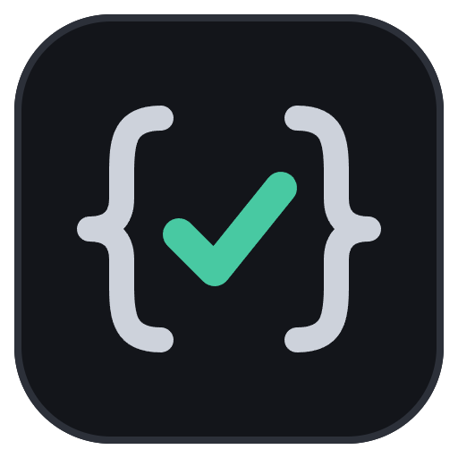
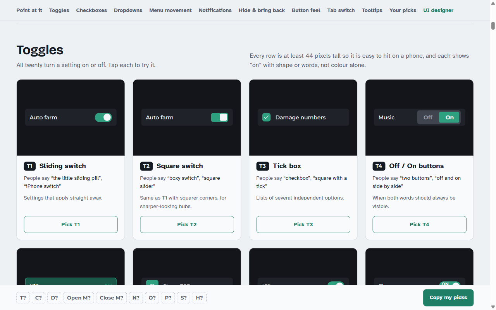

<p align="center">
  
</p>

<h1 align="center">Roblox Luau Expert</h1>

<p align="center">
  Roblox and Luau skills for coding agents, with every engine API checked
  against the real API dump instead of recalled.
</p>

<p align="center">
  <a href="https://github.com/x-Yami-Sukehiro-x/roblox-luau-expert-skill/stargazers"></a>
  
  <a href="https://github.com/x-Yami-Sukehiro-x/roblox-luau-expert-skill/actions/workflows/plugin.yml"></a>
  <a href="LICENSE.md"></a>
</p>

<p align="center">
  <a href="https://x-yami-sukehiro-x.github.io/roblox-luau-expert-skill/">Style picker</a> ·
  <a href="https://x-yami-sukehiro-x.github.io/roblox-luau-expert-skill/designer.html">UI designer</a> ·
  <a href="docs/CHANGELOG.md">Changelog</a> ·
  <a href="#install">Install</a>
</p>

Twenty-seven skills that cover ordinary Roblox game development and
client/executor scripting. They run natively in Claude Code, and the same rules
are generated for Codex, Cursor, a custom GPT and an OpenAI plugin from one
source. Pinned to Roblox API dump `0.739.0.7390687`.



## What you get

- **API answers from ground truth.** A vendored API dump and datatype index
  back `verify-api`; a name it cannot find exits 1, which is the signal an
  agent was about to invent one.
- **UI picked by looking, not by vocabulary.** The
  [style picker](https://x-yami-sukehiro-x.github.io/roblox-luau-expert-skill/)
  labels 215 playable examples with codes such as `T2` or `M4`, and each code
  has a tested recipe the agent pastes instead of rewriting. The
  [UI designer](https://x-yami-sukehiro-x.github.io/roblox-luau-expert-skill/designer.html)
  lays out a whole screen and copies it for an exact rebuild.
- **Executor scripts that clean up after themselves.** Fly, noclip, speed,
  ESP, click teleport, anti-AFK, fullbright, spectate, camera unlock and
  freecam ship as behaviour-tested files that survive respawn and rerun and
  restore what they changed. When one does nothing in a game, a read-only
  doctor script reports what is fighting it.
- **UI that fits every screen and every input.** Panel sizes are computed for
  eleven devices from a 640 x 360 phone to 4K, outlines cut off by a
  scrolling parent are a lint error, and every control is held to one
  contract for mouse, touch and gamepad.
- **Skills that hand work to each other.** The router's skill map says which
  skills open together for each kind of task, and every skill ends with the
  partners it works with, so a host that trims the skill list still reaches
  all of them. `lint-skills.mjs` keeps the list inside the hosts' 8,000
  character budget.
- **A memory of what failed.** Each attempt goes into a ledger in the
  project's `PROJECT_CONTEXT.md`; `attempt-ledger plan` refuses an approach
  that already failed, and `check` finds a recorded mistake back in the code.
- **Counted checks, not advice.** Linters count the ceremony budget, the UI
  rubric, format, API use and compiler register headroom on the final file;
  `check-file.mjs` runs them all in about a second.

## Install

### Claude Code

As a plugin, for every project:

```
/plugin marketplace add x-Yami-Sukehiro-x/roblox-luau-expert-skill
/plugin install roblox-luau-expert@roblox-luau-expert-marketplace
```

Or copy the skills, tools and library into your profile with the installer.
Inside this repository the skills already load from `.claude/skills/`.

```powershell
.\install.ps1                  # Claude Code
.\install.ps1 -HostName All    # Claude Code, Codex and Cursor
.\install.ps1 -Symlink         # link instead of copy (needs Developer Mode)
.\install.ps1 -Uninstall
```

### Codex, Cursor, ChatGPT

| Host | Use | Notes |
|---|---|---|
| Codex | `AGENTS.md` at the repo root, or `install.ps1 -HostName Codex` | full skills bundle |
| Cursor | `.cursor/rules/roblox-luau-expert.mdc` | copy into the project's `.cursor/rules/` |
| ChatGPT and Codex desktop | the plugin in `dist/openai-plugin/` | [openai-plugin.md](docs/portability/openai-plugin.md) |
| chatgpt.com plugins page | upload `roblox-luau-expert-plugin.zip` | [openai-plugin.md](docs/portability/openai-plugin.md#the-copy-uploaded-at-chatgptcomplugins) |
| A custom GPT | `docs/portability/gpt/` | instructions, knowledge files and the click order |

`AGENTS.md`, the Cursor rule and the GPT files are generated from
`docs/portability/rules.md`, so they cannot drift apart.
[auto-update.md](docs/portability/auto-update.md) keeps installed copies in
step with this repository.

## Style codes

Every code in the picker has one exact build in
[style-recipes.md](.claude/skills/roblox-ui-components/references/style-recipes.md)
and a tested file in `.claude/skills/roblox-ui-components/assets/`.

| Group | Codes |
|---|---|
| Toggles | T1–T30 |
| Checkboxes and choice groups | C1–C20 |
| Dropdowns and search fields | D1–D22 |
| Menu movement, opening and closing picked separately | M0–M36 |
| Notifications | N1–N30 |
| Hiding and bringing back the whole UI | O1–O20 |
| Button feel | P1–P22 |
| Tab switch | S1–S22 |
| Tooltips and slider values | H1–H12 |
| Parts of a window, for "make W3 bigger" | W1–W22 |

```bash
python tools/py/recipe.py T2 M4 H3 fly   # the row, the call and the file to paste for each
```

## The skills

One thin router loads on every Roblox task; the rest load when a request
matches their description.

| Skill | Covers |
|---|---|
| **roblox-luau-expert** | Router: hard accuracy rules, symptom table, delivery checklist, the generated `verified/` tables and the common-mistakes catalog |
| **roblox-luau-language** | Types, strict mode, generics, metatables and OOP, `buffer`, `vector`, GC, compiler limits and the register budget |
| **roblox-engine-api** | Instance lifecycle, attributes and tags, the frame pipeline, raycasts, CFrame, Humanoid, animation, tweens, camera, streaming, input |
| **roblox-architecture** | DataModel layout, module patterns, startup, Trove and Janitor, Promise and Signal, frameworks, testing seams |
| **roblox-data-persistence** | DataStore semantics and budgets, session locking, ProfileStore and Lyra, MemoryStore, migrations, loss and duplication |
| **roblox-networking** | Remotes, `UnreliableRemoteEvent`, what replicates, network ownership, bandwidth, latency compensation, `BanAsync` |
| **roblox-performance** | MicroProfiler, ScriptProfiler, memory leaks, per-frame cost, streaming, parallel Luau, native codegen |
| **roblox-request-intake** | Vague and non-technical requests: a spec, a default for every decision, plain-language delivery, error triage |
| **roblox-game-design** | Genre loops, the first session, economy sources and sinks with cost curves, retention systems, `AnalyticsService` events |
| **roblox-ui** | The ten-step build order, six design directions, blueprints, the countable self-review, screen archetypes, broken-UI fixes, UI copy |
| **roblox-ui-components** | Tested recipes for every picker code, notifications, outlines, 9-slice panels, the six interaction states, which icon means what |
| **roblox-ui-motion** | Easing by intent, duration bands, `SmoothDamp` springs, choreography, reduced motion |
| **roblox-ui-tooltips** | Tooltips, info buttons, helper lines, locked reasons, coach marks, slider value readouts; touch and gamepad access |
| **roblox-ui-viewport** | Every screen from a 640 x 360 phone to 4K and ultrawide: panel sizing, a grow-only `UIScale`, insets, overflow, per-device sizes computed |
| **roblox-ui-interaction** | One input contract for mouse, touch and gamepad, hit areas, menus and the character, and the ladder for "the button does nothing" |
| **roblox-vfx-animation** | `AnimationTrack` lifecycle, priority and blending, markers, particles, beams, trails, highlights |
| **roblox-audio** | `Sound` versus the `AudioPlayer` and `Wire` graph, mixing, rolloff, preloading |
| **roblox-monetization** | Idempotent `ProcessReceipt` with a PurchaseId ledger, passes versus products, `PolicyService` |
| **roblox-game-security** | The client threat model, remote hardening, sanity checks, detection versus enforcement |
| **roblox-executor** | The sUNC surface, hooking, memory search, thread identity, anti-cheat recon, RakNet, working from decompiled source |
| **roblox-executor-features** | Tested fly, noclip, speed, infinite jump, ESP, click teleport, anti-AFK, fullbright, spectate, camera unlock and freecam scripts, a feature doctor, and the quality bar for any other |
| **roblox-executor-reliability** | Making a requested feature work in the user's game: who owns the value, what else writes it, the regression matrix, combining features, reading the doctor |
| **roblox-code-craft** | Naming, error messages, `pcall` discipline, comment policy, matching an existing file, AI-generated tells |
| **roblox-reply-craft** | Fast replies, code blocks that paste cleanly, short file names, no filler around the code |
| **roblox-attempt-memory** | The attempt ledger: what was tried, seen and learned, carried across chats and hosts; refuses repeats and reintroduced bugs |
| **roblox-toolchain** | Rojo, Rokit, Wally, selene, StyLua, luau-lsp, Lune, jest-roblox, CI |
| **roblox-studio-mcp** | Checking work in real Studio through its built-in MCP server: read, edit, playtest, console, screen capture, simulated input, and the safety rules |

`roblox-game-security` and `roblox-executor` are deliberate mirrors: knowing
what a client can do is what keeps a defence proportionate.

## Checking work

All Node tools have no dependencies. `tools/py/` holds standard-library Python
ports for hosts without Node, such as a GPT's Code Interpreter, and
`lint-parity.mjs` fails on any difference between the two.

```bash
node tools/bin/check-file.mjs <file.luau>          # slop, format, UI, API, compile, registers, fit, ledger at once
python tools/py/check_file.py <file.luau>          # the same without Node
node tools/bin/verify-api.mjs <Name>               # a Roblox API, against the dump
node tools/bin/verify-executor-api.mjs <name>      # an executor function, against sUNC
node tools/bin/lint-luau-slop.mjs --compare a b    # prove a rewrite changed more than formatting
node tools/bin/check-all.mjs                       # every gate in the repository, one verdict
```

<details>
<summary>Every other check</summary>

```bash
node tools/bin/lint-roblox-ui.mjs <file.luau>     # the UI rubric, counted
python tools/py/viewport_fit.py <file.luau>       # each panel's size, text and targets on eleven devices
node tools/bin/attempt-ledger.mjs plan "<idea>"   # does this approach repeat a failed attempt?
node tools/bin/check-registers.mjs <file.luau>    # headroom under the local-register limit
node tools/bin/verify-asset-ids.mjs <file.luau>   # asks Roblox whether each asset id is a real image
node tools/bin/lint-prose.mjs                     # every API claim in the skills, against the dump
node tools/bin/lint-luau-blocks.mjs               # every shipped Luau example, compiled
node tools/bin/lint-ui-directions.mjs             # every stated contrast ratio, recomputed
node tools/bin/lint-links.mjs                     # every file the skills point at exists
node tools/bin/lint-skills.mjs                    # every skill fits the hosts' listing limits and names its partners
node tools/bin/run-recipe-tests.mjs               # behaviour tests for every recipe and feature script
node tools/bin/run-library-tests.mjs              # assertions over library/src
node tools/bin/generate-tables.mjs --check        # generated tables match the dump
node tools/bin/build-portable.mjs --check         # host rule files are current
node tools/bin/update-dump.mjs --check            # is the vendored dump behind Roblox?
```

Every linter takes a file or a directory, and `lint-luau-slop.mjs` also reads
`--stdin`. The `.ps1` wrappers in `tools/ps1/` forward to the same scripts.

</details>

## Ground truth

| Source | Covers | Why |
|---|---|---|
| `tools/api-dump/API-Dump.txt` | 925 classes, 636 enums, 8,461 members | security levels, deprecation, parallel safety, capabilities |
| `tools/api-dump/datatypes/` | 48 datatypes, 365 members | the dump has no datatypes: `CFrame`, `TweenInfo` and `RaycastParams` are invisible to it |

```bash
node tools/bin/verify-api.mjs GuiService.TopbarInset
#   Property GuiService.TopbarInset: Rect [ReadOnly] {UI}
#     NOT ASSIGNABLE at runtime: [ReadOnly]

node tools/bin/verify-api.mjs GetPlayerHealth
#   NOT FOUND in the Roblox API dump.       <- exit code 1
```

The dump also records what most documentation leaves out: 651 deprecated
members across 148 classes, the direction of a security gate
(`Workspace.StreamingEnabled` is readable by any script and `Plugin`-gated only
for writes), and which members are safe under Actors. The dump comes from
[MaximumADHD/Roblox-Client-Tracker](https://github.com/MaximumADHD/Roblox-Client-Tracker)
and the datatypes from [Roblox/creator-docs](https://github.com/Roblox/creator-docs);
`update-dump.mjs` refreshes the dump and prints what was added, removed and
deprecated.

## Why it counts instead of advising

Version 2 vendored the API dump and still recommended a deprecated call in its
own prose, because nothing pointed the tools at the stack itself. Version 3
added linters that do. Version 4 found the next limit: 2,178 lines of advisory
UI guidance ("pick a direction", "make hierarchy clear") produced the same grey
card grid from a weaker model, which followed the advice and reported that it
had. So the guidance became lookups, procedures, numbers and counted checks:

| Instead of | The stack ships |
|---|---|
| "pick a style direction" | six directions with every colour, font, radius and type size stated and contrast verified |
| "make hierarchy clear" | a ten-step build order, each step gated by a yes or no question |
| "check it does not look generated" | `lint-roblox-ui.mjs`, which resolves what a file builds and counts the rubric |
| "use a real icon" | 1,559 verified Lucide ids, and `verify-asset-ids.mjs` |
| "comment the why, not the what" | a budget with numbers, counted by `lint-luau-slop.mjs` |
| "pick the right executor function" | a layer-to-call map read off the dump, and no fallback chains |
| "write a good component" | a tested recipe for every picker code |

The full history, including what each linter caught, is in
[docs/CHANGELOG.md](docs/CHANGELOG.md).

## Repository layout

```
.claude/skills/          the skills
.claude-plugin/          Claude Code plugin and marketplace manifests
AGENTS.md                generated, for Codex
.cursor/rules/           generated, for Cursor
docs/
  portability/           rules.md, the one source for AGENTS.md, Cursor and the GPT
  visual-guide/          the style picker and UI designer (GitHub Pages)
  assets/                logo, plugin icon and screenshots
  CHANGELOG.md, SOURCES.md, mcp.md, maintenance.md
library/
  src/                   Luau you can require: tokens, layout, motion, toasts, components
  tests/                 headless engine stubs and recipe tests
tools/
  bin/                   Node command-line tools, no dependencies
  py/                    Python ports, parity-gated against bin/
  api-dump/              vendored ground truth
evals/                   routing and accuracy regression prompts
```

## MCP

Use the built-in Roblox Studio MCP server: first-party, enabled from Studio's
Assistant panel, nothing to install. [docs/mcp.md](docs/mcp.md) compares the
alternatives and says why the others were rejected.

## Scope

The executor skills document client-side scripting for private and educational
use on accounts and servers you control. They state the ban risk once and treat
detection and enforcement as separate systems, and they are paired with
`roblox-game-security` so the same knowledge serves defence.
[scope-and-framing.md](docs/portability/scope-and-framing.md) explains the
wording used and what stays declined.

## Sources

Every external source, its licence, its status on a stated date and what was
taken from it is in [docs/SOURCES.md](docs/SOURCES.md), with the sources that
were rejected and why. Popularity and recency figures live there only;
`lint-prose` fails any skill file that states one without a date.

## Star history

<a href="https://www.star-history.com/#x-Yami-Sukehiro-x/roblox-luau-expert-skill&Date">
  <picture>
    <source media="(prefers-color-scheme: dark)" srcset="https://api.star-history.com/svg?repos=x-Yami-Sukehiro-x/roblox-luau-expert-skill&type=Date&theme=dark">
    <source media="(prefers-color-scheme: light)" srcset="https://api.star-history.com/svg?repos=x-Yami-Sukehiro-x/roblox-luau-expert-skill&type=Date">
    
  </picture>
</a>

## License

[PolyForm Strict License 1.0.0](LICENSE.md): free for personal and other
noncommercial use; no selling, no changes, no redistribution. Third-party files
keep their own licences, listed in [NOTICE.md](NOTICE.md).
